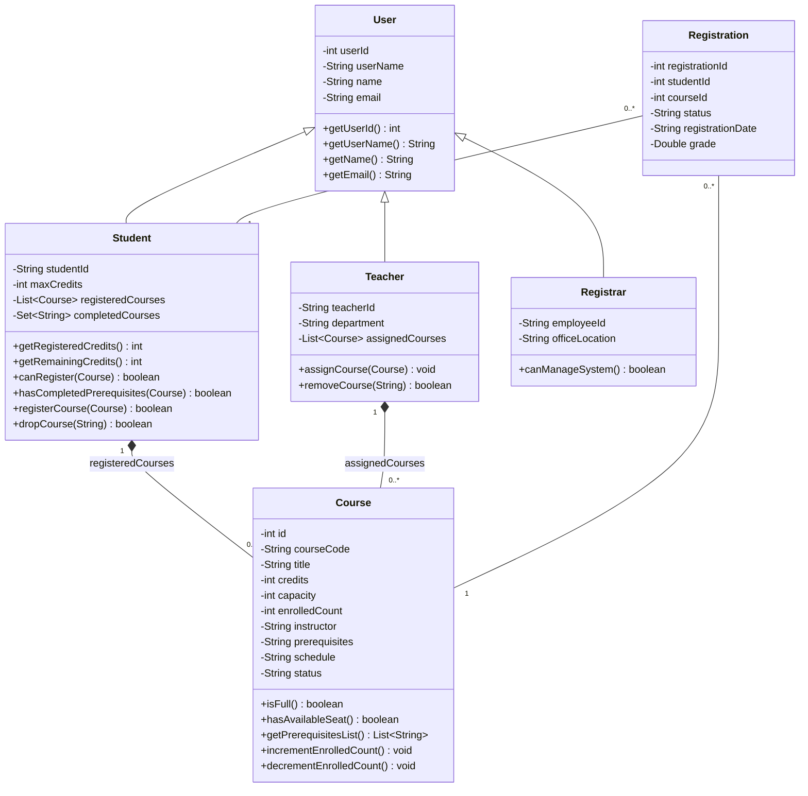

# Design Document: Course Management System

## 1. System Overview
The **Course Management System** (`courser`) is a Java-based enterprise academic administration platform. It provides role-based functionality for **Students**, **Teachers**, and **Registrars** to manage course catalogs, student registrations, prerequisite validations, credit limits, and analytical summaries.

The system is built using a clean 4-tier architecture:
1. **Model Layer (`com.courser.model`)**: Domain entities implementing Object-Oriented Principles (Encapsulation, Inheritance, Polymorphism).
2. **Data Access Object (DAO) Layer (`com.courser.dao` & `com.courser.utils`)**: Database interaction tier using SQLite for persistent storage.
3. **Service Layer (`com.courser.services`)**: Business logic enforcing prerequisite compliance, credit threshold validation, course capacity checks, and reporting.
4. **Server & Application Layer (`com.courser.server` & `com.courser.App`)**: Embedded HTTP Server API (`com.sun.net.httpserver`) and CLI application entry point.

---

## 2. Class Hierarchy & Relationships

---

## 3. Class Specifications

### 3.1 Domain Models (`com.courser.model`)

#### `User`
- **Description**: Base class representing an authenticated user in the system.
- **Attributes**:
  - `int userId`: Unique surrogate database key.
  - `String userName`: Unique login identifier.
  - `String name`: Full display name of the user.
  - `String email`: Contact email address.
- **Key Methods**:
  - `User(int userId, String userName, String name, String email)`: Constructor with validation.
  - Getters and setters for all attributes.
  - `equals(Object o)` & `hashCode()`: Value identity based on `userId` and `userName`.

#### `Student` (Extends `User`)
- **Description**: Domain model for students registered in the institution.
- **Attributes**:
  - `String studentId`: Academic student registration number (e.g., `STU1001`).
  - `int maxCredits`: Credit ceiling (default: 20).
  - `List<Course> registeredCourses`: Active enrolled courses.
  - `Set<String> completedCourses`: Set of completed course codes for prerequisite matching.
- **Key Methods**:
  - `getRegisteredCredits()`: Calculates total credit hours of active registrations.
  - `getRemainingCredits()`: Computes `maxCredits - registeredCredits`.
  - `hasCompletedPrerequisites(Course course)`: Checks if student completed all prerequisites required by the target course.
  - `canRegister(Course course)`: Evaluates credit limits, seat availability, prerequisites, and duplicate check.
  - `registerCourse(Course course)`: Adds course to active registration list.
  - `dropCourse(String courseCode)`: Removes course from active list.

#### `Teacher` (Extends `User`)
- **Description**: Domain model for faculty members teaching courses.
- **Attributes**:
  - `String teacherId`: Faculty ID string.
  - `String department`: Academic department name.
  - `List<Course> assignedCourses`: List of courses assigned to the instructor.
- **Key Methods**:
  - `assignCourse(Course course)`: Links a course to the instructor.
  - `removeCourse(String courseCode)`: Unlinks a course.

#### `Registrar` (Extends `User`)
- **Description**: Domain model for administrative staff managing catalogs and system records.
- **Attributes**:
  - `String employeeId`: Staff identification code.
  - `String officeLocation`: Building/Office number.
- **Key Methods**:
  - `canManageSystem()`: Returns administrative privilege flag (`true`).

#### `Course`
- **Description**: Academic course entity.
- **Attributes**:
  - `int id`: Database primary key.
  - `String courseCode`: Unique course code (e.g., `CS101`).
  - `String title`: Course title.
  - `int credits`: Number of academic credit points.
  - `int capacity`: Maximum student capacity.
  - `int enrolledCount`: Current number of enrolled students.
  - `String instructor`: Name/ID of instructor.
  - `String prerequisites`: Comma-separated list of prerequisite course codes.
  - `String schedule`: Timetable schedule string.
  - `String status`: Status state (`OPEN`, `CLOSED`, `CANCELLED`).
- **Key Methods**:
  - `isFull()`: `enrolledCount >= capacity`.
  - `getPrerequisitesList()`: Parses CSV prerequisites string into `List<String>`.
  - `incrementEnrolledCount()` / `decrementEnrolledCount()`: Updates seat count.

#### `Registration`
- **Description**: Junction entity tracking student course registrations and grades.
- **Attributes**:
  - `int registrationId`: Unique ID.
  - `int studentId`: ID of registering student.
  - `int courseId`: ID of course.
  - `String status`: Status (`REGISTERED`, `DROPPED`, `COMPLETED`).
  - `String registrationDate`: Timestamp of registration.
  - `Double grade`: Final numerical/letter grade achieved.

---

### 3.2 Data Access Objects (`com.courser.dao` & `com.courser.utils`)

#### `Database`
- **Description**: SQLite Connection factory and database initialization utility.
- **Methods**:
  - `getConnection()`: Opens JDBC connection to `courser.db`.
  - `initializeDatabase()`: Creates SQL tables (`users`, `courses`, `registrations`, `student_completed_courses`) if not present.

#### `UserDao`
- **Description**: CRUD operations for `User`, `Student`, `Teacher`, and `Registrar`.
- **Methods**:
  - `saveUser(User user)`: Inserts or updates user records.
  - `findUserById(int id)`: Fetches User object.
  - `findStudentByStudentId(String studentId)`: Fetches Student entity.

#### `CourseDao`
- **Description**: Persistence layer for courses.
- **Methods**:
  - `addCourse(Course course)`: Inserts course.
  - `getAllCourses()`: Retrieves all active courses.
  - `findCourseByCode(String code)`: Queries course by course code.

#### `RegistrationDao`
- **Description**: Database tracking for student registrations.
- **Methods**:
  - `createRegistration(int studentId, int courseId)`: Inserts registration record.
  - `getRegistrationsForStudent(int studentId)`: Fetches registration history.

---

### 3.3 Services (`com.courser.services`)

#### `RegistrationService`
- **Description**: Core business engine managing student registration workflows.
- **Exceptions Handled**: `CourseFullException`, `CreditLimitExceededException`, `DuplicateRegistrationException`, `PrerequisiteNotMetException`.
- **Methods**:
  - `registerStudentForCourse(Student student, Course course)`: Validates rules and executes registration transactionally.

#### `CourseServices`, `StudentServices`, `UserServices`, `SummaryService`
- **Description**: Business services for managing entity lifecycle, user authentication, and analytical reporting.

---

### 3.4 Exception Hierarchy (`com.courser.exception`)
- `RegistrationException` (Base Exception)
  - `CourseFullException`
  - `CreditLimitExceededException`
  - `DuplicateRegistrationException`
  - `PrerequisiteNotMetException`
