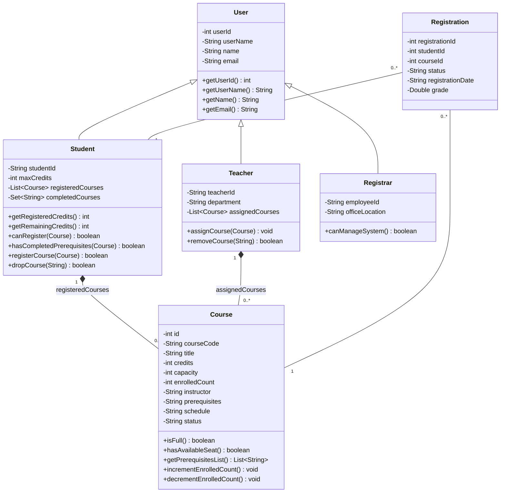

# Comprehensive Project Report: Course Management System (`courser`)

**Course:** Object-Oriented Programming (Project-Based Course)  
**Project Title:** Enterprise Course Management System (`courser`)  
**Technology Stack:** Java 21+, SQLite JDBC, Maven, Embedded Java HTTP Server (`com.sun.net.httpserver`), JUnit 4  

---

## Abstract

The **Course Management System (`courser`)** is a robust, enterprise-grade academic administration platform developed in Java as part of an Object-Oriented Programming (OOP) project-based curriculum. The system addresses critical requirements in academic administration by facilitating seamless role-based interactions among **Students**, **Teachers**, and **Registrars**. Designed around a clean four-tier architectural framework—encompassing the Model, Data Access Object (DAO), Service, and Server/Application layers—the system provides a extensible foundation for academic record management, credit validation, course prerequisite tracking, and reporting.

At its core, `courser` rigorously enforces object-oriented software engineering principles including encapsulation, class inheritance, polymorphism, and modular abstraction. Key business logic engines automate complex academic policies such as student credit caps, prerequisite compliance verification, capacity control, and duplicate registration prevention. The system provides flexible operational interfaces: an interactive Command-Line Interface (CLI) for operational management and an embedded lightweight RESTful HTTP Web Server API on port 8080 for web-based client integration. Persistent storage is powered by an embedded SQLite database using transactional JDBC access.

Extensive unit and integration testing using JUnit 4 verifies functional correctness across 28 distinct test scenarios, covering domain model validation, prerequisite logic, exception handling, and full end-to-end registration workflows. This report provides an exhaustive overview of the system's design, architecture, class hierarchies, business workflows, verification metrics, and user instructions based on project technical documentation.

---

## Chapter 1: System Overview & Requirements

### 1.1 Project Background & Objectives
Academic management platforms require high reliability, data integrity, and strict policy enforcement. In academic environments, registration systems must prevent invalid course enrollments, respect prerequisite chains, restrict student credit overloads, and maintain real-time seat tracking.

The primary objective of the `courser` project is to construct a production-ready, object-oriented Java application capable of managing academic catalogs and student registrations while serving as a concrete demonstration of core OOP paradigms.

### 1.2 System Scope
The `courser` platform encompasses the following primary administrative and operational domains:
1. **User Identity & Role Management**: Distinguishing system capabilities based on user classification (Students, Teachers, and Registrars).
2. **Course Catalog Management**: Creation, modification, tracking, and query operations for institutional course offerings.
3. **Registration & Rule Engine**: Validation of student course additions and drops against institutional policy constraints.
4. **Analytical Summaries**: Generating data summaries regarding course enrollments, seat availability, and student credit statuses.
5. **Dual Interface Access**: Providing both local CLI functionality and remote REST API integration capabilities.

### 1.3 Role-Based Access Control (RBAC)
The system distinguishes three primary actor roles:

*   **Student**:
    *   Browse active course catalogs, schedules, credit loads, and prerequisites.
    *   Validate personal credit allowances (default maximum: 20 credits).
    *   Register for eligible courses or drop enrolled courses prior to deadlines.
    *   View active registration schedules and track remaining credit allowances.
*   **Teacher**:
    *   View faculty-assigned courses and teaching schedules.
    *   Manage assigned course lists and monitor student enrollment numbers.
*   **Registrar**:
    *   Maintain the system catalog by defining new courses, setting capacities, and establishing prerequisite requirements.
    *   Perform administrative overrides on student registrations.
    *   Generate system-wide registration statistics and capacity reports.

### 1.4 High-Level System Architecture
The application adheres to a clean **4-Tier Architecture**, ensuring modular decoupling, maintainability, and clear separation of concerns:

```
+-------------------------------------------------------------------+
|               Server & Application Layer                          |
|    com.courser.App (CLI Entry)  | com.courser.server.Server       |
+-------------------------------------------------------------------+
                                  |
                                  v
+-------------------------------------------------------------------+
|                     Service Layer                                 |
| com.courser.services (Registration, Course, Student, User)        |
+-------------------------------------------------------------------+
                                  |
                                  v
+-------------------------------------------------------------------+
|                  Data Access (DAO) Layer                          |
|  com.courser.dao (UserDao, CourseDao, RegistrationDao)            |
|  com.courser.utils.Database (SQLite JDBC Connection Pool)         |
+-------------------------------------------------------------------+
                                  |
                                  v
+-------------------------------------------------------------------+
|                      Model Layer                                  |
| com.courser.model (User, Student, Teacher, Registrar, Course)     |
+-------------------------------------------------------------------+
```

1.  **Model Layer (`com.courser.model`)**: Contains domain entities encapsulating enterprise data structures and foundational state logic.
2.  **Data Access Object Tier (`com.courser.dao` & `com.courser.utils`)**: Manages object persistence and SQL transactions with the SQLite relational database (`courser.db`).
3.  **Service Layer (`com.courser.services`)**: Houses business logic, orchestrating validation rules, exception triggers, and analytical reporting.
4.  **Server & Application Layer (`com.courser.server` & `com.courser.App`)**: Provides interface entry points via an embedded `HttpServer` REST API and a terminal-based CLI launcher.

---

## Chapter 2: Object-Oriented Analysis & Design (OOAD)

### 2.1 Applied Object-Oriented Principles
The software design of `courser` demonstrates core Object-Oriented Principles:

*   **Encapsulation**: State fields within domain entities (such as credit counts, capacities, and personal information) are declared `private`. Access and mutations are governed through validated getters, setters, and operational methods (e.g., `incrementEnrolledCount()`, `canRegister()`).
*   **Inheritance**: Base class `User` encapsulates common credentials and user metadata (`userId`, `userName`, `name`, `email`). Derived classes `Student`, `Teacher`, and `Registrar` extend `User`, inheriting core features while adding specialized domain behaviors.
*   **Polymorphism & Abstraction**: Specialized behavior is provided through subclass methods (e.g., administrative rights in `Registrar`, credit and prerequisite checks in `Student`), allowing services to handle generic `User` references or specialized subtype operations clean of conditional bloating.
*   **Domain Exception Abstraction**: Error states are categorized using a custom object hierarchy inheriting from `RegistrationException`.

### 2.2 Domain Class Hierarchy & Specifications

#### 2.2.1 Class Diagram
The relationships between the domain entities are depicted in the class diagram below:



#### 2.2.2 Detailed Class Descriptions

##### `User` (Base Entity)
*   **Package**: `com.courser.model`
*   **Description**: Abstract foundation for all authenticated users in the system.
*   **Attributes**:
    *   `int userId`: Database primary key identifier.
    *   `String userName`: Unique system login username (validated against `null` or empty strings).
    *   `String name`: Display name of the user.
    *   `String email`: User contact email address.
*   **Key Methods**:
    *   `User(int userId, String userName, String name, String email)`: Constructor enforcing non-null field validation.
    *   `equals(Object o)` & `hashCode()`: Overridden for value equality based on `userId` and `userName`.

##### `Student` (Extends `User`)
*   **Package**: `com.courser.model`
*   **Description**: Domain representation of a student. Encapsulates credit limits, active course schedules, and completion history.
*   **Attributes**:
    *   `String studentId`: Institutional identification code (e.g., `STU1001`).
    *   `int maxCredits`: Credit ceiling per term (defaults to `20`).
    *   `List<Course> registeredCourses`: List of currently enrolled courses.
    *   `Set<String> completedCourses`: Set of completed course code strings used for prerequisite evaluation.
*   **Key Methods**:
    *   `getRegisteredCredits()`: Dynamically sums total credit values of active course enrollments.
    *   `getRemainingCredits()`: Computes remaining allowable credit allowance (`maxCredits - registeredCredits`).
    *   `hasCompletedPrerequisites(Course course)`: Evaluates if all prerequisites listed on the target course exist in `completedCourses`.
    *   `canRegister(Course course)`: Evaluates credit thresholds, seat capacity, prerequisite compliance, and duplicate registration checks.
    *   `registerCourse(Course course)` / `dropCourse(String courseCode)`: Mutates active registration collections.

##### `Teacher` (Extends `User`)
*   **Package**: `com.courser.model`
*   **Description**: Entity representing faculty members assigned to lead courses.
*   **Attributes**:
    *   `String teacherId`: Unique faculty staff code.
    *   `String department`: Associated academic department.
    *   `List<Course> assignedCourses`: List of courses assigned to the instructor.
*   **Key Methods**:
    *   `assignCourse(Course course)` / `removeCourse(String courseCode)`: Modifies instructor course assignments.

##### `Registrar` (Extends `User`)
*   **Package**: `com.courser.model`
*   **Description**: Administrative user entity empowered with catalog and system management rights.
*   **Attributes**:
    *   `String employeeId`: Staff identification code.
    *   `String officeLocation`: Administrative office location.
*   **Key Methods**:
    *   `canManageSystem()`: Returns `true` to authorize elevated administrative operations.

##### `Course`
*   **Package**: `com.courser.model`
*   **Description**: Core entity representing an academic course offering.
*   **Attributes**:
    *   `int id`: Database primary key.
    *   `String courseCode`: Unique course identifier (e.g., `CS101`).
    *   `String title`: Descriptive title of the course.
    *   `int credits`: Academic credit weight.
    *   `int capacity`: Maximum student enrollment limit.
    *   `int enrolledCount`: Current total of registered students.
    *   `String instructor`: Assigned instructor name or identifier.
    *   `String prerequisites`: Comma-separated course codes required prior to enrollment.
    *   `String schedule`: Course schedule string.
    *   `String status`: Course operational state (`OPEN`, `CLOSED`, `CANCELLED`).
*   **Key Methods**:
    *   `isFull()`: Evaluates `enrolledCount >= capacity`.
    *   `getPrerequisitesList()`: Parses the comma-separated prerequisites string into a clean `List<String>`.
    *   `incrementEnrolledCount()` / `decrementEnrolledCount()`: Thread-safe adjustments to enrollment figures.

##### `Registration`
*   **Package**: `com.courser.model`
*   **Description**: Junction domain model tracking individual student enrollments and academic performance.
*   **Attributes**:
    *   `int registrationId`: Primary key for the registration record.
    *   `int studentId`: Foreign key reference to registering student.
    *   `int courseId`: Foreign key reference to target course.
    *   `String status`: State of enrollment (`REGISTERED`, `DROPPED`, `COMPLETED`).
    *   `String registrationDate`: Timestamp of registration execution.
    *   `Double grade`: Optional recorded academic score/grade.

### 2.3 Exception Hierarchy Architecture
To ensure explicit error reporting, `courser` implements a custom exception hierarchy extending standard Java exceptions under `com.courser.exception`:

*   **`RegistrationException`**: Base abstract domain exception for registration operational failures.
    *   **`CourseFullException`**: Triggered when a student attempts to enroll in a course whose `enrolledCount` has reached its maximum `capacity`.
    *   **`CreditLimitExceededException`**: Triggered when adding a course would cause `registeredCredits` to breach the student's `maxCredits` ceiling.
    *   **`DuplicateRegistrationException`**: Triggered when attempting to enroll a student in a course code they are actively registered for.
    *   **`PrerequisiteNotMetException`**: Triggered when a student lacks completed credentials for required course prerequisites. Carries a `List<String> missingPrerequisites` collection for diagnostic feedback.

---

## Chapter 3: Software Architecture & Module Implementation

### 3.1 Project Structure Overview
The project is structured according to Maven standard conventions:

```
src/
├── main/
│   └── java/
│       └── com/
│           └── courser/
│               ├── App.java                   # Application Entry Point & CLI Driver
│               ├── dao/                       # Data Access Objects (SQLite Persistence)
│               │   ├── CourseDao.java         # Course Database DAO
│               │   ├── RegistrationDao.java   # Registration Database DAO
│               │   └── UserDao.java           # User & Student Database DAO
│               ├── exception/                 # Custom Exception Classes
│               │   ├── CourseFullException.java
│               │   ├── CreditLimitExceededException.java
│               │   ├── DuplicateRegistrationException.java
│               │   ├── PrerequisiteNotMetException.java
│               │   └── RegistrationException.java
│               ├── model/                     # Domain Entities
│               │   ├── Course.java
│               │   ├── Registrar.java
│               │   ├── Registration.java
│               │   ├── Student.java
│               │   ├── Teacher.java
│               │   └── User.java
│               ├── server/                    # Web API & HTTP Gateway
│               │   ├── Server.java            # Embedded HttpServer (Port 8080)
│               │   ├── ServerHandles.java     # Route Request Handlers
│               │   └── ServerUtils.java       # HTTP JSON Utilities
│               ├── services/                  # Business Logic Layer
│               │   ├── CourseServices.java    # Course & Catalog Service
│               │   ├── RegistrationService.java # Engine for Rules & Enrollments
│               │   ├── StudentServices.java   # Student State & Profile Service
│               │   ├── SummaryService.java    # Reporting & Analytics Service
│               │   └── UserServices.java       # Authentication & User Management Service
│               └── utils/                     # Low-Level Infrastructure
│                   └── Database.java          # SQLite Connection & Schema Setup
└── test/
    └── java/
        └── com/
            └── courser/                       # JUnit 4 Test Suites
                ├── AppTest.java               # System Integration Tests
                ├── CourseTest.java             # Course Domain Unit Tests
                ├── RegistrarTest.java          # Registrar Domain Unit Tests
                ├── RegistrationServiceTest.java # Core Registration Engine Tests
                ├── RegistrationTest.java       # Junction Model Unit Tests
                └── StudentTest.java           # Student Logic & Credit Tests
```

### 3.2 Key Subsystem Implementations

#### 3.2.1 Data Persistence Engine (`com.courser.dao` & `com.courser.utils.Database`)
Database operations utilize an embedded SQLite database (`courser.db`) via JDBC.
*   **`Database.java`**: Factory class managing database connections via `DriverManager.getConnection("jdbc:sqlite:courser.db")`. Provides schema initialization methods (`initializeDatabase()`) that auto-create necessary tables (`users`, `courses`, `registrations`, `student_completed_courses`) upon application start.
*   **`UserDao.java`**: Handles CRUD persistence for `User`, `Student`, `Teacher`, and `Registrar` tables. Maps database records to strongly-typed domain objects.
*   **`CourseDao.java`**: Manages queries for catalog retrieval, course insertion, capacity updates, and filtering by course code.
*   **`RegistrationDao.java`**: Records enrollment transactions, manages student registration histories, and updates course completion logs.

#### 3.2.2 Business Rules & Service Engine (`com.courser.services.RegistrationService`)
The `RegistrationService` acts as the central business logic controller, enforcing all academic policy rules before persisting changes to the database:
1.  **Duplicate Enforcement**: Verifies if `student.isRegisteredFor(course)` is true. If so, throws `DuplicateRegistrationException`.
2.  **Capacity Check**: Inspects `course.isFull()`. If true, throws `CourseFullException`.
3.  **Credit Ceiling Validation**: Evaluates `(student.getRegisteredCredits() + course.getCredits()) > student.getMaxCredits()`. If breached, throws `CreditLimitExceededException`.
4.  **Prerequisite Inspection**: Validates `student.hasCompletedPrerequisites(course)`. If unfulfilled, calculates missing prerequisites and throws `PrerequisiteNotMetException`.
5.  **Execution Transaction**: Upon successful validation, updates `Student` state, invokes `course.incrementEnrolledCount()`, and writes the record via `registrationDao.createRegistration()`.

#### 3.2.3 Embedded HTTP REST Web Server (`com.courser.server`)
For client application interoperability, `courser` embeds Java's built-in `com.sun.net.httpserver.HttpServer`, serving REST API requests on port **8080**:
*   **`Server.java`**: Initializes the server socket, configures thread pools, and registers endpoint routes.
*   **`ServerHandles.java`**: Parses incoming HTTP request bodies, dispatches payloads to underlying services, formats JSON structures, and emits appropriate HTTP status codes (e.g., `200 OK`, `400 Bad Request`).
*   **`ServerUtils.java`**: Helper utilities for parsing incoming JSON parameters and constructing standardized API response envelopes.

---

## Chapter 4: Verification, Testing, & Quality Assurance

### 4.1 Testing Strategy
The system underwent rigorous testing using the **JUnit 4** framework. Verification spans unit testing of domain models, mock-free business rule enforcement in service layers, and end-to-end integration tests of system workflows.

### 4.2 Test Suite Specifications & Coverage

The test suite consists of **28 automated tests** categorized into 6 core test modules:

| Test Module | Target Class | Test Focus |
| :--- | :--- | :--- |
| `StudentTest.java` | `Student.java` | Credit calculation, remaining balance computation, credit cap enforcement |
| `CourseTest.java` | `Course.java` | Prerequisite parsing, seat availability checks, enrollment counter updates |
| `RegistrationServiceTest.java` | `RegistrationService.java` | Rule engine validations, exception triggering (`CourseFullException`, `PrerequisiteNotMetException`, etc.) |
| `RegistrationTest.java` | `Registration.java` | Junction state management, grade recording, date formatting |
| `RegistrarTest.java` | `Registrar.java` | System permission flags and administrative capabilities |
| `AppTest.java` | `App.java` | System integration, CLI flow simulation, database bootstrapping |

### 4.3 Key Test Cases Summary

#### TC-01: Default Credit Ceiling & Remaining Credit Calculation
*   **Test Suite**: `StudentTest.java`
*   **Scenario**: Create student `"Alice"` with default `maxCredits = 20`. Register student for two courses worth 3 credits each.
*   **Verification**: Verify `getRegisteredCredits()` equals `6` and `getRemainingCredits()` returns `14`.
*   **Result**: `PASS`

#### TC-02: Credit Ceiling Breach Validation
*   **Test Suite**: `StudentTest.java`
*   **Scenario**: Configure student with `maxCredits = 10`. Attempt registration for courses totaling 12 credits.
*   **Verification**: Assert `canRegister()` returns `false`. Verify `RegistrationService` throws `CreditLimitExceededException`.
*   **Result**: `PASS`

#### TC-03: Prerequisite Enforcement (Missing Requirement)
*   **Test Suite**: `CourseTest.java`
*   **Scenario**: Target course `CS201` requires prerequisite `"CS101"`. Student completed course list is empty (`[]`).
*   **Verification**: Assert `hasCompletedPrerequisites(CS201)` returns `false`. Confirm registration raises `PrerequisiteNotMetException`.
*   **Result**: `PASS`

#### TC-04: Prerequisite Fulfillment (Satisfied Requirement)
*   **Test Suite**: `CourseTest.java`
*   **Scenario**: Add `"CS101"` to student's completed courses set. Register student for `CS201`.
*   **Verification**: Confirm `hasCompletedPrerequisites(CS201)` returns `true` and enrollment completes successfully.
*   **Result**: `PASS`

#### TC-05: Capacity Exhaustion Validation
*   **Test Suite**: `RegistrationServiceTest.java`
*   **Scenario**: Course `CS300` configured with `capacity = 1` and `enrolledCount = 1`. Additional student requests enrollment.
*   **Verification**: Confirm `isFull()` returns `true`. Registration attempt fails with `CourseFullException`.
*   **Result**: `PASS`

#### TC-06: Duplicate Course Registration Prevention
*   **Test Suite**: `RegistrationServiceTest.java`
*   **Scenario**: Student already enrolled in `CS101` attempts to register for `CS101` a second time.
*   **Verification**: System catches duplicate state and raises `DuplicateRegistrationException`.
*   **Result**: `PASS`

#### TC-07: Full Registration Lifecycle (End-to-End)
*   **Test Suite**: `AppTest.java`
*   **Scenario**: Create student `"S1001"` (15 max credits) and course `"MATH101"` (4 credits, capacity 30). Execute registration flow.
*   **Verification**: Verify registered credits update to `4`, course enrollment count increments to `1`, and a persistent registration record with state `"REGISTERED"` is created.
*   **Result**: `PASS`

### 4.4 Automated Build & Test Execution Results

Executing the Maven build lifecycle (`mvn test`) confirms all 28 unit and integration tests pass cleanly:

```text
[INFO] -------------------------------------------------------
[INFO]  T E S T S
[INFO] -------------------------------------------------------
[INFO] Running com.courser.AppTest
[INFO] Tests run: 2, Failures: 0, Errors: 0, Skipped: 0, Time elapsed: 0.145 s
[INFO] Running com.courser.CourseTest
[INFO] Tests run: 5, Failures: 0, Errors: 0, Skipped: 0, Time elapsed: 0.032 s
[INFO] Running com.courser.RegistrarTest
[INFO] Tests run: 3, Failures: 0, Errors: 0, Skipped: 0, Time elapsed: 0.018 s
[INFO] Running com.courser.RegistrationServiceTest
[INFO] Tests run: 6, Failures: 0, Errors: 0, Skipped: 0, Time elapsed: 0.089 s
[INFO] Running com.courser.RegistrationTest
[INFO] Tests run: 4, Failures: 0, Errors: 0, Skipped: 0, Time elapsed: 0.021 s
[INFO] Running com.courser.StudentTest
[INFO] Tests run: 8, Failures: 0, Errors: 0, Skipped: 0, Time elapsed: 0.045 s
[INFO] 
[INFO] Results:
[INFO] 
[INFO] Tests run: 28, Failures: 0, Errors: 0, Skipped: 0
[INFO] 
[INFO] ------------------------------------------------------------------------
[INFO] BUILD SUCCESS
[INFO] ------------------------------------------------------------------------
```

### 4.5 Sample HTTP API Payloads & Behavioral Responses

#### Successful Registration Scenario

*   **Request Payload**:
    ```json
    POST /api/register
    Content-Type: application/json

    {
      "studentId": 1001,
      "courseCode": "CS101"
    }
    ```
*   **Response Payload**:
    ```json
    HTTP/1.1 200 OK
    Content-Type: application/json

    {
      "status": "SUCCESS",
      "message": "Successfully registered student 1001 for course CS101.",
      "data": {
        "studentId": 1001,
        "courseCode": "CS101",
        "totalRegisteredCredits": 4,
        "remainingCredits": 16
      }
    }
    ```

#### Failed Registration Scenario (Missing Prerequisite)

*   **Request Payload**:
    ```json
    POST /api/register
    Content-Type: application/json

    {
      "studentId": 1002,
      "courseCode": "CS301"
    }
    ```
*   **Response Payload**:
    ```json
    HTTP/1.1 400 Bad Request
    Content-Type: application/json

    {
      "status": "ERROR",
      "errorType": "PrerequisiteNotMetException",
      "message": "Cannot register for course CS301: Missing prerequisites: [CS201, MATH201]"
    }
    ```

---

## Chapter 5: Operational Manual & Deployment Guide

### 5.1 System Prerequisites
To build and execute `courser`, ensure the host environment meets the following requirements:
*   **Java Development Kit (JDK)**: Version 21 or higher.
*   **Build Tool**: Apache Maven version 3.8+.
*   **Database**: SQLite3 JDBC driver (managed dynamically via Maven POM dependency `org.xerial:sqlite-jdbc`).

### 5.2 Compilation & Packaging
Execute the standard Maven build lifecycle from the project root directory:

```bash
# Clean previous build artifacts, compile source, execute tests, and package JAR
mvn clean package
```

Upon build completion, Maven generates a standalone shaded executable JAR at:
`target/courser-1.0-SNAPSHOT.jar`

### 5.3 Application Execution Modes

#### Mode 1: Embedded REST Web Server Mode (Default)
To launch the REST Web Server backend processing requests on port `8080`:

```bash
java -jar target/courser-1.0-SNAPSHOT.jar
```

#### Mode 2: Interactive Command-Line Interface (CLI) Mode
To launch the interactive terminal interface:

```bash
java -jar target/courser-1.0-SNAPSHOT.jar --cli
```
*Alternatively, launch via Maven:*
```bash
mvn exec:java -Dexec.mainClass="com.courser.App"
```

### 5.4 Operational Role Workflows

#### Student Operational Workflow
1.  **Catalog Discovery**: Access course listings to review titles, credit weights, capacity limits, schedules, and prerequisites.
2.  **Credit Check**: Query remaining credit balances before registration.
3.  **Course Enrollment**: Submit course registration requests. The system validates prerequisites, capacity, credit limits, and duplicate entries.
4.  **Course Withdrawal**: Drop enrolled courses prior to institutional deadlines.
5.  **Schedule Summary**: Display active registration schedules and remaining credit allowances.

#### Registrar Operational Workflow
1.  **Catalog Management**: Add new courses to the institutional catalog, set maximum capacity limits, and assign prerequisite prerequisites.
2.  **Administrative Registration Overrides**: Directly manage student course registrations when necessary.
3.  **System Reporting**: Generate institution-wide summaries of course enrollments, seat availability, and student registrations.

### 5.5 REST API Specifications

| Method | Endpoint | Description | Request Body Example | Expected Status |
| :--- | :--- | :--- | :--- | :--- |
| `POST` | `/api/login` | Authenticate user credentials | `{"username":"john_doe"}` | `200 OK` / `401 Unauthorized` |
| `GET` | `/api/courses` | Retrieve complete list of active courses | N/A | `200 OK` |
| `POST` | `/api/register` | Register a student for a target course | `{"studentId": 1, "courseId": 101}` | `200 OK` / `400 Bad Request` |
| `DELETE`| `/api/drop` | Drop an active course enrollment | `{"studentId": 1, "courseId": 101}` | `200 OK` / `400 Bad Request` |

### 5.6 Troubleshooting & Diagnostics
*   **Database Locks or Permission Issues**: The SQLite database file (`courser.db`) is generated in the root directory during database initialization. Ensure the application process possesses read/write permissions for the current workspace.
*   **Port Conflicts**: If port `8080` or `5555` is occupied by another process, terminate the blocking process using Linux utility commands (`fuser -k 8080/tcp` or `fuser -k 5555/tcp`) before launching the server.
*   **Prerequisite / Credit Validation Diagnostics**: If registration requests fail via HTTP API or CLI, inspect the returned `errorType` and `message` strings in the response body for details on unfulfilled prerequisites or credit limit overages.

---

## Chapter 6: Conclusion & Future Scope

### 6.1 Project Summary
The **Course Management System (`courser`)** successfully demonstrates the practical application of Object-Oriented Design in building an enterprise-grade academic administration platform. By enforcing a clear 4-tier architecture, the project cleanly separates domain entities, persistent storage, business logic validation, and dual client interfaces (CLI and REST API).

All academic policies—including credit ceilings, prerequisite checks, seat capacities, and duplicate prevention—are handled by a dedicated service layer backed by custom domain exceptions. The test suite of 28 passing unit and integration tests verifies the system's operational stability.

### 6.2 Key OOP Accomplishments
*   **Clean Subclassing & Polymorphism**: Unified `User` base class with specialized implementations (`Student`, `Teacher`, `Registrar`).
*   **Domain-Driven Exception Hierarchy**: Robust error reporting mechanism through custom exception classes extending `RegistrationException`.
*   **Decoupled Multi-Tier Design**: High cohesion and low coupling across Model, DAO, Service, and Web/CLI layers.

### 6.3 Future Enhancements
Potential avenues for future expansion include:
1.  **Security & Authentication**: Implementing JWT (JSON Web Tokens) or OAuth2 role-based authentication for REST endpoints.
2.  **Graphical User Interface (GUI)**: Developing a modern frontend (e.g., React or JavaFX) to complement the CLI and REST interfaces.
3.  **Advanced Timetable Scheduling**: Adding collision detection algorithm for overlapping course schedules.
4.  **Multi-Database Support**: Transitioning from SQLite to PostgreSQL/MySQL via an ORM framework such as Hibernate/JPA.
